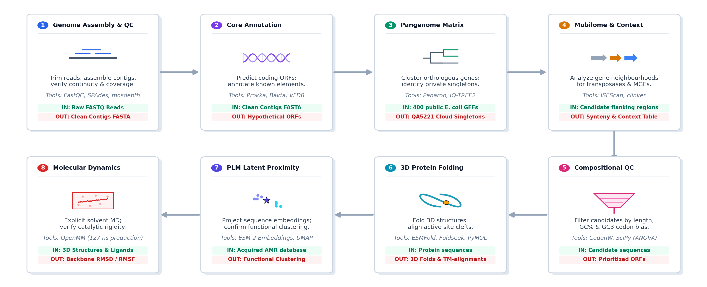

# AMR Novel Gene Discovery

[](LICENSE)
[](https://www.python.org/)
[](https://anaconda.org/)
[](https://ubuntu.com/)
[](https://github.com/hosniadilemp-a11y/AMR_Novel_Gene_Discovery/releases)
[](https://github.com/hosniadilemp-a11y/AMR_Novel_Gene_Discovery/commits/main)
[](https://github.com/hosniadilemp-a11y/AMR_Novel_Gene_Discovery/issues)
[](https://github.com/hosniadilemp-a11y/AMR_Novel_Gene_Discovery/stargazers)


# AMR Novel Gene Discovery — Reproducibility Package

**Manuscript:** Structure-guided prioritization of divergent virulence and resistance candidates in an open pangenome clinical *Escherichia coli* isolate

**Journal:** *Microbiology* (Springer/Nature)

**Authors:** Sarra Benmoumou-Hosni, Atika Meklat, Ikram Haleche

**Isolate:** *Escherichia coli* QA5221 (Sequence Type ST354, ExPEC)

**Raw Sequencing Reads:** NCBI SRA accession **SRR39314025** 
 (BioProject: **PRJNA1481519**) 

[]()
[](https://doi.org/10.5281/zenodo.21073430)
[](CITATION.cff)
[](https://www.python.org/)
[](environment/environment.yml)
[](https://github.com/hosniadilemp-a11y/AMR_Novel_Gene_Discovery)
[](https://ubuntu.com/)
[](https://github.com/hosniadilemp-a11y/AMR_Novel_Gene_Discovery/releases)
[](https://www.ncbi.nlm.nih.gov/sra/SRR39314025)
[](https://www.ncbi.nlm.nih.gov/bioproject/PRJNA1481519)
<br>


## Pipeline Schema



---

## Table of Contents

1. [Scientific Objective](#scientific-objective)
2. [Repository Structure](#repository-structure)
3. [System Requirements](#system-requirements)
4. [Installation](#installation)
5. [Data Acquisition](#data-acquisition)
6. [Pipeline Overview](#pipeline-overview)
7. [Step-by-Step Execution](#step-by-step-execution)
8. [Figure and Table Map](#figure-and-table-map)
9. [Supplementary Materials](#supplementary-materials)
10. [Computational Resources](#computational-resources)
11. [Reproducibility Notes](#reproducibility-notes)
12. [Citation](#citation)

---

## Scientific Objective

A substantial fraction of predicted coding sequences in draft bacterial genomes—frequently exceeding 30%—are classified as hypothetical proteins because they lie in the "twilight zone" of sequence homology (<20–25% amino acid identity with characterized proteins). These divergent genes may encode novel antimicrobial resistance (AMR) or virulence determinants that are invisible to standard annotation tools.

This repository contains the complete computational pipeline used to:

1. **Characterize** the genomic, pangenomic, and mobilome landscape of the clinical multidrug-resistant *E. coli* ST354 isolate QA5221 from Algiers, Algeria.
2. **Identify** 23 pangenomic singleton hypothetical proteins unique to QA5221 and absent from the ST354 pangenome.
3. **Validate** four priority candidates through an integrated pangenome-to-structure pipeline combining:
   - Structural fold prediction (ESMFold, AlphaFold3)
   - Structural homology search (Foldseek, TM-align)
   - Protein language model embedding (ESM-2 650M, UMAP, t-SNE)
   - Explicit-solvent molecular dynamics simulations (OpenMM, 127 ns)
   - Molecular docking and MM-GBSA free energy analysis (AutoDock Vina)

The four prioritized candidates are:
| Locus Tag | Candidate Name | Predicted Function | Key Evidence |
|---|---|---|---|
| `KNGPFPPJ_02769` | GNAT_KA27 | GCN5-related N-acetyltransferase (aminoglycoside modifying enzyme) | TM-score=0.957, ΔG=-22.91 kcal/mol |
| `KNGPFPPJ_00061` | Ehly_61 | Pore-forming enterohemolysin cytolysin | TM-score=0.590, RMSD=2.99 Å |
| `KNGPFPPJ_03161` | OAgP_161 | O-antigen polymerase (Wzy) | TM-score=0.895, RMSD=2.53 Å |
| `KNGPFPPJ_04371` | OAT_371 | Outer-membrane autotransporter adhesin | AlphaFold3 model, plasmid-borne |

---

## Repository Structure

```
AMR_Novel_Gene_Discovery/
├── README.md                          # This file
├── LICENSE                            # MIT License
├── CITATION.cff                       # Citation metadata
├── .gitignore                         # Files not tracked by git
│
├── environment/
│   ├── environment.yml                # Conda environment (amr_env)
│   ├── requirements.txt               # Python pip packages
│   └── INSTALL.md                     # Detailed installation guide
│
├── config/
│   ├── pipeline_config.yaml           # Master pipeline parameters
│   └── md_config.yaml                 # Molecular dynamics parameters
│
├── scripts/
│   ├── 01_qc_trimming.sh              # Step 1: FastQC + Cutadapt + MultiQC
│   ├── 02_assembly.sh                 # Step 2: SPAdes + QUAST + Minimap2 + mosdepth
│   ├── 03_annotation.sh               # Step 3: Prokka + ABRicate + AMRFinderPlus + MOB-suite
│   ├── 03b_pangenome.sh               # Step 3b: Download genomes + Panaroo + IQ-TREE
│   ├── 04_mge_detection.sh            # Step 4: ISEScan + IntegronFinder + clinker
│   ├── 05_novel_candidates.py         # Step 5: Pangenome singleton extraction + BLASTp + Pfam
│   ├── 06a_esmfold_prediction.py      # Step 6a: ESMFold structure prediction (Kaggle/GPU)
│   ├── 06b_foldseek_search.py         # Step 6b: Foldseek structural homology search
│   ├── 06c_tmalign_validation.py      # Step 6c: Local TM-align validation
│   ├── 07_plm_embeddings.py           # Step 7: ESM-2 PLM embeddings + UMAP + t-SNE + DeepARG
│   ├── 08_novelty_scoring.py          # Step 8: 16-point weighted novelty scoring
│   ├── 09a_md_setup.py                # Step 9a: OpenMM MD system preparation
│   ├── 09b_md_production.py           # Step 9b: OpenMM MD production run
│   ├── 09c_md_analysis.py             # Step 9c: RMSD, RMSF, Rg, DCCM, block averaging
│   ├── 10_docking.py                  # Step 10: AutoDock Vina docking + MM-GBSA
│   ├── generate_figures.py            # Generates all publication figures (Fig 1–23)
│   ├── download_genomes.py            # NCBI genome batch downloader
│   └── annotate_references.py         # Parallel Prokka annotation of reference genomes
│
├── workflows/
│   ├── run_all.sh                     # Master pipeline orchestrator
│   ├── run_genomics_only.sh           # Steps 1–8 (no MD/docking)
│   └── run_md_only.sh                 # MD and docking steps only
│
├── data/
│   ├── README.md                      # Data acquisition instructions
│   ├── reference_accessions/
│   │   ├── st354_cohort_accessions.txt     # 32 ST354 reference genomes (NCBI)
│   │   └── outgroup_accessions.txt         # 4 outgroup reference genomes
│   └── sequences/
│       ├── candidates.faa             # 23 novel candidate protein sequences (FASTA)
│       ├── prioritized_candidates.faa # 4 priority candidates (FASTA)
│       └── amr_reference_panel.faa    # 35 known AMR proteins (PLM reference panel)
│
├── results/
│   ├── README.md
│   ├── step5_candidates/
│   │   ├── prioritized_candidates.tsv # Final 23 candidates table
│   │   └── advanced_stats_results.json
│   ├── step7_plm/
│   │   ├── esm2_650m_embeddings.npy   # 1280-dim ESM-2 embeddings
│   │   ├── esm2_650m_coordinates.tsv  # UMAP + t-SNE 2D coordinates
│   │   └── plm_distance_matrix.tsv    # Pairwise Euclidean distances
│   ├── step7_docking/
│   │   ├── docking_specificity_results.tsv
│   │   └── mmgbsa_binding_energies.tsv
│   └── step7_blast/
│       ├── KNGPFPPJ_02769_blast_hits.tsv
│       ├── KNGPFPPJ_00061_blast_hits.tsv
│       ├── KNGPFPPJ_03161_blast_hits.tsv
│       └── KNGPFPPJ_04371_blast_hits.tsv
│
├── figures/
│   ├── README.md                      # Figure-to-script mapping table
│   └── [all manuscript figures — PDF + PNG]
│
├── logs/
│   ├── README.md                      # Log file registry
│   ├── step1_cutadapt.log
│   ├── step7_md_apo_gnat.csv          # 127-ns GNAT MD thermodynamic log
│   ├── step7_md_00061.csv             # Enterohemolysin MD log
│   ├── step7_md_03161.csv             # O-antigen polymerase MD log
│   └── step7_vina_docking/            # AutoDock Vina log files per ligand
│
├── supplementary/
│   ├── Table_S1_Assembly_QC.tsv
│   ├── Table_S2_ST354_Cohort_Accessions.tsv
│   ├── Table_S6_Codon_Bias_Statistics.tsv
│   ├── Table_S8_Foldseek_Alignments.tsv
│   ├── Table_S11_PanGWAS_Results.tsv
│   └── pan_gwas_association_results.csv
│
└── docs/
    ├── installation.md
    ├── pipeline_overview.md
    ├── reproducibility_notes.md
    └── figure_table_map.md
```

---

## System Requirements


| Component | Requirement |
|---|---|
| **Operating System** | Linux (Ubuntu 20.04+ / Debian 11+ recommended) |
| **CPU** | Minimum 8 cores; 16+ cores recommended for pangenome steps |
| **RAM** | Minimum 32 GB; 64 GB recommended for Panaroo (400 genome cohort) |
| **Storage** | ~500 GB free space (raw reads + assemblies + MD trajectories) |
| **GPU** | NVIDIA GPU with 16+ GB VRAM for ESMFold (optional; Kaggle T4 used) |
| **Python** | 3.10–3.12 (see conda environment) |
| **Conda** | Miniconda3 or Anaconda |

> **Note on GPU steps:** ESMFold (Step 6) and PLM embedding extraction (Step 7) require a GPU. The scripts are configured to run on [Kaggle](https://www.kaggle.com/) free T4 GPU notebooks. Instructions for uploading and running Kaggle notebooks are in `docs/pipeline_overview.md`.

---

## Installation

### 1. Clone the repository

```bash
git clone https://github.com/hosniadilemp-a11y/AMR_Novel_Gene_Discovery.git
cd AMR_Novel_Gene_Discovery
```

### 2. Create the Conda environment

```bash
conda env create -f environment/environment.yml
conda activate amr_env
```

This creates the `amr_env` environment with all bioinformatics tools. Installation takes approximately 15–30 minutes depending on network speed.

### 3. Initialize databases

```bash
# Update AMRFinderPlus database
conda run -n amr_env amrfinder -u

# Initialize MOB-suite database
conda run -n amr_env mob_init
```

### 4. Verify installation

```bash
bash scripts/01_qc_trimming.sh --check-only
```

See `environment/INSTALL.md` for detailed platform-specific instructions and troubleshooting.

---

## Data Acquisition

### Raw Sequencing Reads

The raw Illumina paired-end reads for isolate QA5221 are deposited in the NCBI Sequence Read Archive:

- **SRA Accession:** `SRR39314025`
- **BioProject:** `PRJNA1481519`

Download using:

```bash
conda run -n amr_env fasterq-dump SRR39314025 --outdir data/raw_reads/ --split-files
gzip data/raw_reads/SRR39314025_1.fastq data/raw_reads/SRR39314025_2.fastq
# Rename to match pipeline expectations
mv data/raw_reads/SRR39314025_1.fastq.gz data/raw_reads/QA5221_R1.fastq.gz
mv data/raw_reads/SRR39314025_2.fastq.gz data/raw_reads/QA5221_R2.fastq.gz
```

### Reference Genome Cohort

The ST354 reference genome accessions are listed in `data/reference_accessions/st354_cohort_accessions.txt`. Download using:

```bash
conda run -n amr_env python3 scripts/download_genomes.py \
    --accessions data/reference_accessions/st354_cohort_accessions.txt \
    --output results/step3/reference_genomes/
```

### Pre-computed Results

All computationally expensive results (ESM-2 embeddings, Foldseek alignments, MD trajectories) are available in the `results/` and `logs/` directories. You can skip re-running those steps and proceed directly to figure generation.

---

## Pipeline Overview

The analysis pipeline consists of 10 sequential steps:

```
Step 1 ──► Step 2 ──► Step 3 ──► Step 4 ──► Step 5
  QC         Assem.    Annot.     MGE        Candidates
  ~1h        ~3h       ~2h        ~1h        ~30min

Step 6 ──► Step 7 ──► Step 8 ──► Step 9 ──► Step 10
  Struct.    PLM        Scoring    MD          Docking
  ~4h(GPU)  ~3h(GPU)   ~30min     ~200h       ~2h
```

| Step | Phase | Key Tool | Input | Output | Runtime |
|---|---|---|---|---|---|
| 1 | QC & Trimming | FastQC, Cutadapt | Raw FASTQ | Trimmed FASTQ | ~1 h |
| 2 | Assembly | SPAdes, QUAST | Trimmed FASTQ | contigs.fasta | ~3 h |
| 3 | Annotation | Prokka, ABRicate, AMRFinderPlus | contigs.fasta | GFF, GBK, TSV | ~2 h |
| 3b | Pangenome | Panaroo, IQ-TREE | 32 GFF files | Pangenome matrix, tree | ~12 h |
| 4 | MGE | ISEScan, IntegronFinder, clinker | contigs.fasta | IS/integron maps | ~1 h |
| 5 | Candidates | Custom Python, BLASTp, Pfam | Prokka GFF + pangenome | 23 candidates FAA | ~30 min |
| 6 | Structure | ESMFold / AlphaFold3, Foldseek | candidates.faa | PDB structures, alignments | ~4 h (GPU) |
| 7 | PLM / Docking | ESM-2, UMAP, DeepARG, AutoDock Vina | candidates.faa | Embeddings, docking poses | ~3 h (GPU) + ~2 h |
| 8 | Scoring | Custom Python | All outputs | Novelty score table | ~30 min |
| 9 | MD Simulation | OpenMM | PDB structures | DCD trajectories, logs | ~200 h GPU |
| 10 | MD Analysis | MDAnalysis, custom Python | DCD + topology | RMSD, RMSF, DCCM figures | ~4 h |

---

## Step-by-Step Execution

### Quick Start — Full Pipeline

```bash
conda activate amr_env
bash workflows/run_all.sh \
    --r1 data/raw_reads/QA5221_R1.fastq.gz \
    --r2 data/raw_reads/QA5221_R2.fastq.gz \
    --threads 16 \
    --output results/
```

### Individual Steps

#### Step 1: Quality Control and Trimming

```bash
bash scripts/01_qc_trimming.sh \
    --r1 data/raw_reads/QA5221_R1.fastq.gz \
    --r2 data/raw_reads/QA5221_R2.fastq.gz \
    --threads 8 \
    --output results/step1_qc/
```

**Outputs:**
- `results/step1_qc/trimmed_reads/trimmed_R1.fastq` — Trimmed forward reads
- `results/step1_qc/trimmed_reads/trimmed_R2.fastq` — Trimmed reverse reads
- `results/step1_qc/multiqc_report/multiqc_report.html` — Quality summary report
- `logs/step1_cutadapt.log` — Cutadapt trimming statistics

**Parameters:** `-q 30` quality cutoff; `-m 50` minimum read length.

---

#### Step 2: De Novo Assembly and Validation

```bash
bash scripts/02_assembly.sh \
    --r1 results/step1_qc/trimmed_reads/trimmed_R1.fastq \
    --r2 results/step1_qc/trimmed_reads/trimmed_R2.fastq \
    --threads 8 \
    --output results/step2_assembly/
```

**Outputs:**
- `results/step2_assembly/spades_output/contigs.fasta` — De novo assembly
- `results/step2_assembly/quast_report/report.html` — QUAST assembly statistics
- `results/step2_assembly/coverage_validation/coverage_report.mosdepth.summary.txt` — Per-contig coverage

**Expected QC metrics:**
- Genome size: ~5.03 Mb
- N50: ~294,640 bp
- Number of contigs (≥500 bp): 60
- Mean coverage depth: ~43.89×

---

#### Step 3: Genome Annotation and AMR Profiling

```bash
bash scripts/03_annotation.sh \
    --contigs results/step2_assembly/spades_output/contigs.fasta \
    --threads 4 \
    --output results/step3_annotation/
```

Includes:
- Prokka gene annotation
- ABRicate against ResFinder and VFDB
- AMRFinderPlus comprehensive screening
- MOB-suite plasmid reconstruction and typing
- MLST sequence typing (expected: ST354)

---

#### Step 3b: Pangenome and Phylogenetics

```bash
bash scripts/03b_pangenome.sh \
    --accessions data/reference_accessions/st354_cohort_accessions.txt \
    --focal-gff results/step3_annotation/prokka_out/QA5221.gff \
    --threads 16 \
    --output results/step3_pangenome/
```

**Key parameters:**
- Panaroo: `--clean-mode strict`, MAFFT alignment
- IQ-TREE: `-m GTR+F+I+G4 -bb 1000`

**Expected pangenome statistics:**
| Partition | Gene Clusters | Percentage |
|---|---|---|
| Soft Core (≥95%) | 3,298 | 35.91% |
| Shell (15%–95%) | 2,295 | 24.99% |
| Cloud (<15%) | 3,591 | 39.10% |
| **Total** | **9,184** | **100%** |

Pangenome openness parameter α = 0.8699 (open pangenome confirmed).

---

#### Step 4: Mobile Genetic Element Detection

```bash
bash scripts/04_mge_detection.sh \
    --contigs results/step2_assembly/spades_output/contigs.fasta \
    --threads 8 \
    --output results/step4_mge/
```

**Expected outputs:**
- 22 IS elements from 9 families (NODE_24 MDR hotspot)
- 1 In0 integrase (NODE_43) + 1 CALIN array with 6 attC sites (NODE_37)

---

#### Step 5: Novel Candidate Extraction

```bash
conda run -n amr_env python3 scripts/05_novel_candidates.py \
    --prokka-dir results/step3_annotation/prokka_out/ \
    --pangenome results/step3_pangenome/panaroo_out/gene_presence_absence.csv \
    --min-length 200 \
    --output results/step5_candidates/
```

**Candidate filtering criteria:**
1. Hypothetical proteins ≥200 aa in Prokka annotation
2. Private pangenomic singletons (absent from all 31 reference genomes)
3. BLASTp against UniProt Swiss-Prot (E-value < 1e-5) — retain no-hit sequences
4. EBI Pfam REST API scan — retain sequences with no domain signature
5. Non-low-complexity (DUST filter)

**Expected output:** 23 prioritized candidate proteins in `data/sequences/candidates.faa`

---

#### Step 6: Protein Structure Prediction (GPU Required)

> **Note:** Steps 6a and 7 require GPU resources. Upload `scripts/06a_esmfold_prediction.py` and `scripts/07_plm_embeddings.py` to a Kaggle notebook with a T4 GPU. Detailed instructions are in `docs/pipeline_overview.md`.

```bash
# ESMFold on Kaggle GPU (upload script to Kaggle notebook)
# Download resulting PDB files to: results/step6_structures/esmfold/

# Local Foldseek search after downloading PDBs
conda run -n amr_env python3 scripts/06b_foldseek_search.py \
    --pdb-dir results/step6_structures/esmfold/ \
    --databases pdb100,afdb50,afdb-swissprot \
    --output results/step6_structures/foldseek_results/

# TM-align local validation
conda run -n amr_env python3 scripts/06c_tmalign_validation.py \
    --query-pdb results/step6_structures/esmfold/ \
    --target-pdb results/step6_structures/target_structures/ \
    --output results/step6_structures/tmalign_results.tsv
```

**Expected key results:**
| Candidate | Target | TM-score | RMSD (Å) |
|---|---|---|---|
| KNGPFPPJ_02769 | 1S5K (GNAT acetyltransferase) | 0.9569 | 1.55 |
| KNGPFPPJ_00061 | Enterohemolysin | 0.5899 | 2.99 |
| KNGPFPPJ_03161 | O-antigen polymerase (Wzy) | 0.8953 | 2.53 |

---

#### Step 7: PLM Embeddings and Molecular Docking

```bash
# PLM embeddings (GPU — Kaggle)
# Script: scripts/07_plm_embeddings.py
# Upload to Kaggle, download: results/step7_plm/

# Local docking
conda run -n amr_env python3 scripts/10_docking.py \
    --receptor results/step6_structures/esmfold/KNGPFPPJ_02769.pdb \
    --ligands data/ligands/ \
    --grid-center "2.964 2.776 2.588" \
    --output results/step7_docking/
```

**MM-GBSA binding free energies (Experiment 3):**
| Ligand | Type | ΔG_binding (kcal/mol) |
|---|---|---|
| Kanamycin | ✅ Aminoglycoside | **−23.90** |
| Amikacin | ✅ Aminoglycoside | **−23.10** |
| Gentamicin | ✅ Aminoglycoside | **−21.73** |
| Penicillin G | ❌ Decoy | −14.01 |
| D-Glucose | ❌ Decoy | −11.70 |
| Tetracycline | ❌ Decoy | −10.72 |

**Selectivity gap: ~10.8 kcal/mol ≈ 10⁸-fold aminoglycoside preference**

---

#### Step 8: Novelty Scoring

```bash
conda run -n amr_env python3 scripts/08_novelty_scoring.py \
    --candidates results/step5_candidates/prioritized_candidates.tsv \
    --foldseek results/step6_structures/foldseek_results/ \
    --plm results/step7_plm/ \
    --mge results/step4_mge/ \
    --coverage results/step2_assembly/coverage_validation/ \
    --output results/step8_scoring/
```

**16-point weighted scoring framework:**

| Criterion | Max Points |
|---|---|
| Pangenome singleton (private) | 3 |
| Structural novelty (Foldseek) | 3 |
| HGT GC-content evidence | 2 |
| PLM AMR proximity | 2 |
| Novel domain / No Pfam hit | 2 |
| Selection pressure proxy | 2 |
| Genomic island context | 1 |
| Read-coverage support | 1 |
| **Total** | **16** |

---

#### Step 9: Molecular Dynamics Simulations

> **Note:** Full MD simulations require 127+ ns production runs. The GNAT_KA27 simulation took ~7 days on an NVIDIA RTX 3090. Pre-computed trajectories and analysis data are available in `logs/`.

```bash
# System preparation
conda run -n amr_openmm python3 scripts/09a_md_setup.py \
    --pdb results/step6_structures/esmfold/KNGPFPPJ_02769.pdb \
    --output results/step9_md/gnat_apo/

# Production MD
conda run -n amr_openmm python3 scripts/09b_md_production.py \
    --system results/step9_md/gnat_apo/solvated_system.pdb \
    --steps 64000000 \
    --output results/step9_md/gnat_apo/

# Analysis
conda run -n amr_openmm python3 scripts/09c_md_analysis.py \
    --topology results/step9_md/gnat_apo/solvated_system.pdb \
    --trajectory results/step9_md/gnat_apo/md_trajectory.dcd \
    --output results/step9_md/gnat_apo/analysis/
```

**MD simulation parameters:**
- Force field: AMBER14-all + TIP3P water
- Ensemble: NPT at 310 K, 1.0 atm
- Timestep: 2 fs; reporting every 1000 steps
- Integration: Langevin thermostat (1 ps⁻¹ friction), Monte Carlo barostat
- Non-bonded cutoff: 1.0 nm; PME long-range electrostatics
- Constraint: HBonds

---

#### Step 10: Figure Generation

```bash
conda run -n amr_env python3 scripts/generate_figures.py \
    --all \
    --output figures/
```

Or generate individual figures:

```bash
# Figure 1 (Pipeline schema)
python3 scripts/generate_figures.py --fig 1

# Figure 21 (MD RMSD/Rg panel)
python3 scripts/generate_figures.py --fig 21
```

---

## Figure and Table Map

| Figure | Title | Generating Script | Data Source |
|---|---|---|---|
| Fig. 1 | Discovery pipeline schema | `generate_figures.py --fig 1` | Conceptual |
| Fig. 3c | Pangenome accumulation (Heap's Law) | `generate_figures.py --fig 3c` | `results/step3_pangenome/` |
| Fig. 4 | Core-genome ML phylogeny | `generate_figures.py --fig 4` | IQ-TREE treefile |
| Fig. 6 | AMR genetic context maps | `generate_figures.py --fig 6` | `results/step4_mge/` |
| Fig. 8 | GC vs GC3 codon bias scatter | `generate_figures.py --fig 8` | Prokka `.ffn` + pangenome |
| Fig. 9b | Candidate codon bias | `generate_figures.py --fig 9b` | `results/step5_candidates/` |
| Fig. 10b | GNAT structural alignment | `generate_figures.py --fig 10b` | TM-align + PDB |
| Fig. 12 | GNAT superfamily phylogeny | `generate_figures.py --fig 12` | IQ-TREE + MAFFT |
| Fig. 13 | Hemolysin structural alignment | `generate_figures.py --fig 13` | TM-align + PDB |
| Fig. 14 | Wzy structural alignment | `generate_figures.py --fig 14` | TM-align + PDB |
| Fig. 16 | Autotransporter alignment | `generate_figures.py --fig 16` | TM-align + PDB |
| Fig. 17 | pLDDT confidence profiles | `generate_figures.py --fig 17` | ESMFold output |
| Fig. 20a | PLM UMAP projection | `generate_figures.py --fig 20a` | `results/step7_plm/` |
| Fig. 20b | PLM t-SNE projection | `generate_figures.py --fig 20b` | `results/step7_plm/` |
| Fig. 21 | GNAT MD RMSD + Rg | `generate_figures.py --fig 21` | `logs/step7_md_apo_gnat.csv` |
| Fig. 22 | Multi-protein MD RMSF | `generate_figures.py --fig 22` | `logs/step7_md_*.csv` |

| Table | Title | Source |
|---|---|---|
| Table S1 | Assembly QC metrics | `results/step2_assembly/quast_report/` |
| Table S2 | ST354 cohort accessions | `data/reference_accessions/` |
| Table S6 | Codon bias statistics | `results/step5_candidates/advanced_stats_results.json` |
| Table S8 | Foldseek alignments | `results/step6_structures/foldseek_results/` |
| Table S11 | Pan-GWAS results | `results/step3_pangenome/pan_gwas_results.csv` |

---

## Supplementary Materials

All supplementary tables are provided in TSV format in the `supplementary/` directory.

The supplementary materials PDF is compiled from `docs/supplementary_materials.tex`.

---

## Computational Resources

| Analysis | Resources Used | Estimated Runtime |
|---|---|---|
| Step 1–5 (Genomics) | 16 CPU cores, 64 GB RAM | ~20 hours |
| Step 6 (ESMFold) | Kaggle T4 GPU (16 GB) | ~4 hours |
| Step 7 (PLM embeddings) | Kaggle T4 GPU (16 GB) | ~3 hours |
| Step 9a (GNAT_KA27 MD, 127 ns) | NVIDIA RTX 3090, 24 GB VRAM | ~7 days |
| Step 9b (Ehly_61 MD, 100 ns) | NVIDIA RTX 3090, 24 GB VRAM | ~5 days |
| Step 9c (OAgP_161 MD, 100 ns) | NVIDIA RTX 3090, 24 GB VRAM | ~5 days |
| MD Analysis (Steps 10) | 8 CPU cores, 32 GB RAM | ~4 hours |
| **Total (excl. MD)** | — | **~32 hours** |
| **Total (incl. MD)** | — | **~17 days** |

---

## Reproducibility Notes

1. **Random seeds:** UMAP uses `random_state=42`, t-SNE uses `random_state=42`. These values are hardcoded in `scripts/07_plm_embeddings.py` and `config/pipeline_config.yaml`.

2. **Database versions:**
   - AMRFinderPlus database: 2026-05-15.1
   - UniProt Swiss-Prot: downloaded 2025-12 (local BLASTp)
   - EBI Pfam API: accessed 2025-11 (version 37.0)
   - Foldseek databases: afdb50, pdb100 (accessed 2025-12)

3. **ESMFold model:** `esm_if1_gvp4_t16_142M_UR50` (Meta ESM v1, Kaggle-cached)

4. **Panaroo pangenome:** `--clean-mode strict` with MAFFT alignment. Running in `--clean-mode relaxed` may produce slightly different cluster counts.

5. **IQ-TREE:** Ultrafast bootstraps (1000 replicates) with `-m GTR+F+I+G4`. Exact bootstrap values may differ across runs due to the stochastic nature of the algorithm; the topology is robust.

6. **MD trajectories:** The large DCD trajectory files (GNAT: 8.4 GB; Ehly: ~6 GB; OAgP: ~6 GB) are not stored in this repository due to GitHub file size limits. They are archived at:
   - NCBI BioProject `PRJNA1481519` (to be deposited on publication)
   - Zenodo DOI: `10.5281/zenodo.XXXXXXX` (to be created on publication)

7. **IntegronFinder bug workaround:** The integron detection script includes a custom fix for an IntegronFinder database cross-contamination bug. See `docs/reproducibility_notes.md` for details.

8. **MOB-suite patches:** Three Pandas 3.0 compatibility patches were applied to the MOB-suite package. These patches are documented in `docs/reproducibility_notes.md` and are automatically applied by the setup script.

---

## Citation

If you use this pipeline or data in your research, please cite:

```bibtex
@article{benmoumou2026amr,
  title     = {Structure-guided prioritization of divergent virulence and resistance
               candidates in an open pangenome clinical {Escherichia coli} isolate},
  author    = {Benmoumou-Hosni, Sarra and Meklat, Atika and Haleche, Ikram},
  journal   = {Microbiology},
  year      = {2026},
  doi       = {TBD},
  url       = {https://github.com/hosniadilemp-a11y/AMR_Novel_Gene_Discovery}
}
```

Raw sequencing data is deposited at NCBI SRA under accession **SRR39314025** (BioProject **PRJNA1481519**).

---

## License

This repository is released under the [MIT License](LICENSE). See `LICENSE` for details.

---

## Contact

**Corresponding Author:** Sarra Benmoumou-Hosni  
**Email:** sarra_ben@outlook.fr  
**Affiliation:** Laboratoire de Biologie des Systèmes Microbiens, École Normale Supérieure de Kouba, 16000 Alger, Algeria
